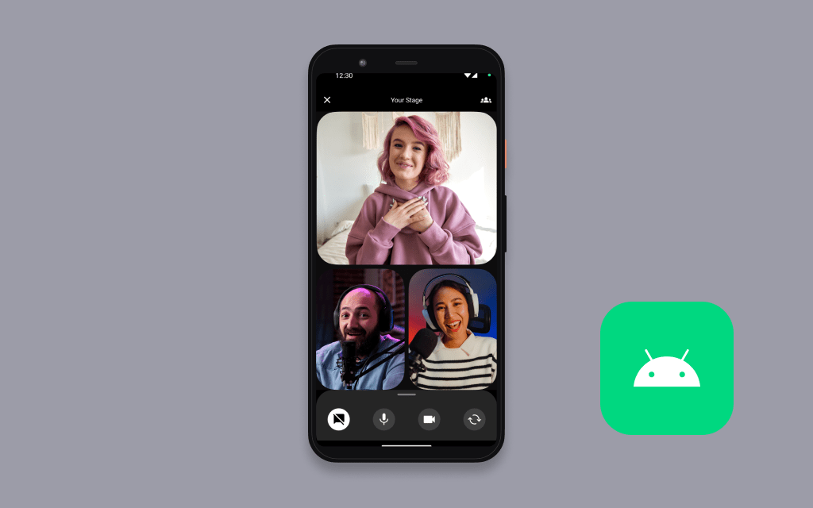

# Amazon IVS Multi-host for Android Demo

A demo Kotlin Android phone application intended as an educational tool to demonstrate how you can build a real-time collaborative live streaming experience with [Amazon IVS](https://www.ivs.rocks/).

**This project is intended for education purposes only and not for production usage.**

## Prerequisites

You must have the `ApiUrl` from the [Amazon IVS Multi-host Serverless Demo](https://www.github.com/aws-samples/amazon-ivs-multi-host-serverless-demo).

## Setup

1. Clone the repository to your local machine.
2. Open the repository in [Android Studio](https://developer.android.com/studio), or an IDE of your choice.
3. Open `app/build.gradle` file and set constants for:
   - Replace `<API_URL>` with the `ApiUrl` output from the [Amazon IVS Multi-host Serverless Demo](https://www.github.com/aws-samples/amazon-ivs-multi-host-serverless-demo). Do NOT remove the escaped quotations
     `\"`
   - If you are using [Android Studio](https://developer.android.com/studio), the app will ask to sync the project since the gradle file has been changed. Select Sync now to sync.
4. Run the application on an emulated device or a physical device running API level 33 or later.

**IMPORTANT NOTE:** Joining a stage and streaming in the app will create and consume AWS resources, which will cost money.

## Known Issues

- This app has only been tested on devices running Android 13 and API level 33 or later. While this app may work on older versions of Android, they have not been extensively tested.
- A list of known issues for the Amazon IVS Broadcast SDK is available on the following page: [Amazon IVS Broadcast SDK: Android Guide](https://docs.aws.amazon.com/ivs/latest/userguide/broadcast-android.html#broadcast-android-issues-multiple-hosts)

## More Documentation

- [Amazon IVS Android Broadcast SDK Guide](https://docs.aws.amazon.com/ivs/latest/userguide/broadcast-android.html)
- [Amazon IVS Android Broadcast SDK Sample code](https://github.com/aws-samples/amazon-ivs-broadcast-android-sample)
- [More code samples and demos](https://www.ivs.rocks/examples)

## License

This project is licensed under the MIT-0 License. See the LICENSE file.
